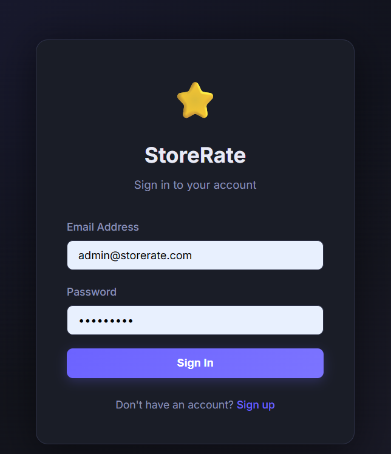
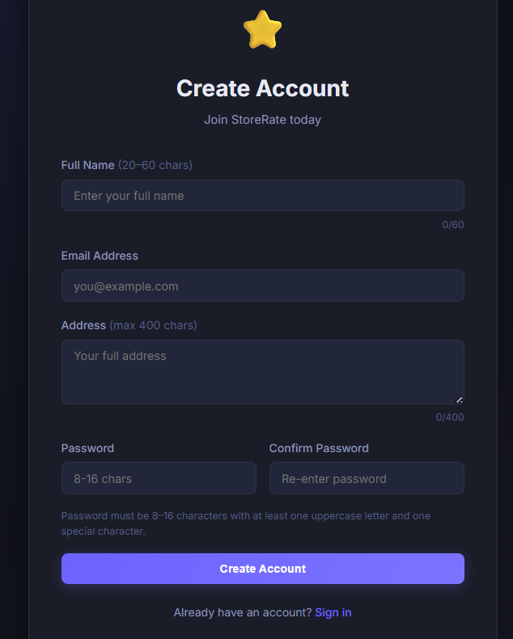
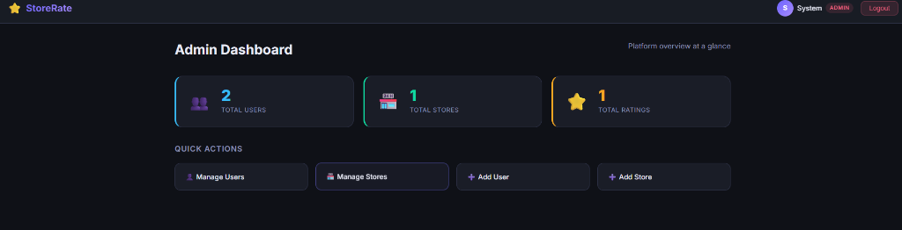
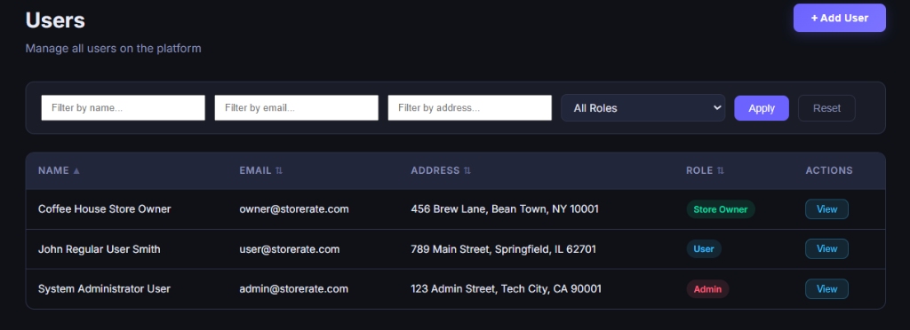
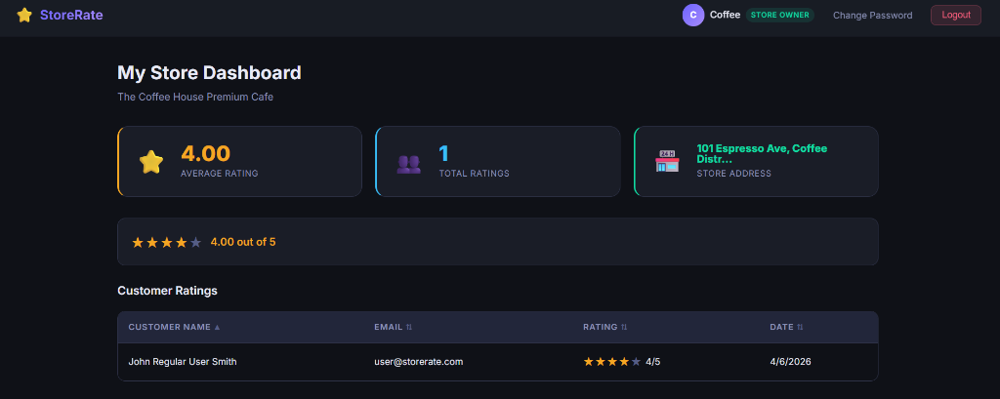

# StoreRate — Full-Stack Store Rating Platform

A full-stack web application for rating registered stores.
Built with **Express.js + MySQL + React (Vite)**.


## 📸 App Showcase

### 🔐 Authentication
| Login Page | Create Account Page |
|:---:|:---:|
|  |  |

### 👑 Admin Workspace
| Admin Dashboard | User Management |
|:---:|:---:|
|  |  |

### ☕ Store Owner Portal
| Store Owner Dashboard |
|:---:|
|  |

---


## 🛠 Setup Instructions

### Prerequisites
- Node.js v18+
- MySQL server running locally

---

### 1. Configure Database Credentials

Edit `backend/.env` and set your MySQL password:

```env
PORT=5000
DB_HOST=localhost
DB_USER=root
DB_PASSWORD=YOUR_MYSQL_PASSWORD_HERE
DB_NAME=stores_register
JWT_SECRET=stores_register_jwt_secret_key_2024
```

Then create the database in MySQL:
```sql
CREATE DATABASE stores_register;
```

---

### 2. Install & Seed Backend

```bash
cd backend
npm install          # already done
npm run seed         # creates all tables + sample data
npm run dev          # start backend at http://localhost:5000
```

---

### 3. Start Frontend

```bash
cd frontend
npm install          # already done
npm run dev          # start at http://localhost:5173
```

---

## 🔑 Default Login Credentials (after seed)

| Role         | Email                    | Password    |
|--------------|--------------------------|-------------|
| Admin        | admin@storerate.com       | Admin@123   |
| Store Owner  | owner@storerate.com      | Owner@123   |
| Normal User  | user@storerate.com       | User@1234   |

---

## 👥 User Roles & Features

### System Administrator
- Dashboard: total users / stores / ratings stats
- Add users (any role) and stores
- View & filter all users and stores (by name, email, address, role)
- View user details (store rating shown for Store Owners)
- Full sorting on all tables (ASC/DESC)

### Normal User
- Self-register with full validation
- Browse all stores with search (name, address)
- Submit and modify ratings (1–5 stars) per store
- Update own password

### Store Owner
- Dashboard: average store rating + list of all raters
- Update own password

---

## 📋 Form Validation Rules

| Field    | Rule                                                         |
|----------|--------------------------------------------------------------|
| Name     | 20–60 characters                                            |
| Email    | Standard email format                                        |
| Address  | Max 400 characters                                           |
| Password | 8–16 chars, ≥1 uppercase letter, ≥1 special character        |

---

## 🗂 Project Structure

```
stores register/
├── backend/
│   ├── config/database.js     ← Sequelize MySQL connection
│   ├── models/                ← User, Store, Rating
│   ├── controllers/           ← auth, admin, store, owner
│   ├── middleware/auth.js     ← JWT authenticate + authorize
│   ├── routes/                ← auth, admin, stores, owner
│   ├── seed.js                ← Database seed script
│   ├── server.js              ← Express app entry
│   └── .env                   ← ⚠️ Set your DB_PASSWORD here
└── frontend/
    └── src/
        ├── api/axios.js        ← Axios with JWT interceptor
        ├── context/AuthContext ← Auth state management
        ├── components/         ← Navbar, ProtectedRoute, SortableTable, StarRating
        └── pages/
            ├── Login / Register
            ├── admin/          ← Dashboard, Users, Stores, AddUser, AddStore, UserDetail
            ├── user/           ← Stores (rate), UpdatePassword
            └── owner/          ← Dashboard
```

---

## 🔌 API Endpoints

| Method | Endpoint                  | Auth       | Description                  |
|--------|---------------------------|------------|------------------------------|
| POST   | /api/auth/register        | Public     | User signup                  |
| POST   | /api/auth/login           | Public     | Login (all roles)            |
| PUT    | /api/auth/password        | Any role   | Update password              |
| GET    | /api/admin/dashboard      | Admin      | Stats                        |
| GET    | /api/admin/users          | Admin      | List users (filter+sort)     |
| GET    | /api/admin/users/:id      | Admin      | User detail                  |
| POST   | /api/admin/users          | Admin      | Create user                  |
| GET    | /api/admin/stores         | Admin      | List stores (filter+sort)    |
| POST   | /api/admin/stores         | Admin      | Create store                 |
| GET    | /api/stores               | User       | List stores with user rating |
| POST   | /api/stores/ratings       | User       | Submit rating                |
| PUT    | /api/stores/ratings/:id   | User       | Update rating                |
| GET    | /api/owner/dashboard      | StoreOwner | Owner store data             |
